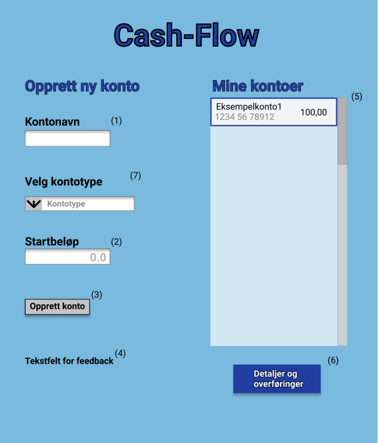
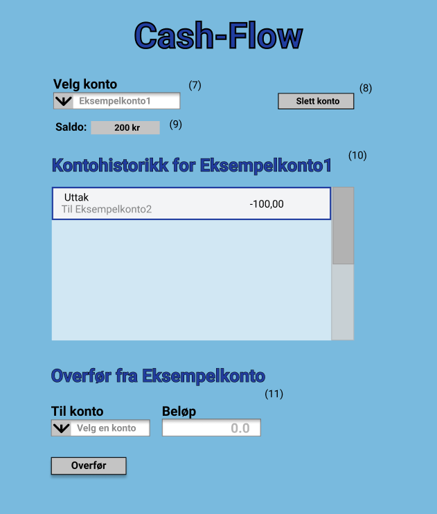

# CashFlow-app

Prosjektet går ut på en app som implementere bank-funksjonalitet. Appen skal fungere på lik linje som andre banker, der det skal være mulig å opprette, slette eller overføre mellom brukskontoer, sparekontoer og Bsu-kontoer.
Det vil også være mulig å se kontohistorikken til alle kontoene og alle transaksjoner på valgt konto.

## User 
User brukes som et toppnivå for lagring av kontoer. Det ble lagt til felter som user-ID og brukernavn for å identifisere brukere, men disse blir per nå ikke brukt i aplikasjonen. Disse feltene vil være nyttige dersom aplikasjonen skal utvides til å støtte håndtering av flere brukere. Da kan man for eksempel overføre mellom brukere og lagre de forskjellige brukerene i en database. I starten av prosjektet hadde gruppen ambisjoner om å støtte denne funksjonaliteten, men valgte etterhvert å begrese seg til en bruker.

## Kontotyper og restriksjoner

**CheckingAccount (Brukskonto):** Ingen restriksjoner

**SavingsAccount (Sparekonto):** Kan bare gjøre ti uttak. 

**BsuAccount (Bsu-konto):** Kan bare opprette én konto. Kan bare inneholde 25 000 kr. Kan ikke gjøre uttak.

**Merk**: Appen har ikke noen form for tidsperspektiv. I forhold til en vanlig bankapplikasjon kan man tenke seg at CashFlow opererer på et ettårs-perspektiv. Altså vil for eksempel maksimalt antall uttak i en sparekonto aldri fornyes, og ting som renter tas ikke hensyn til.

# Skissering av aplikasjon

