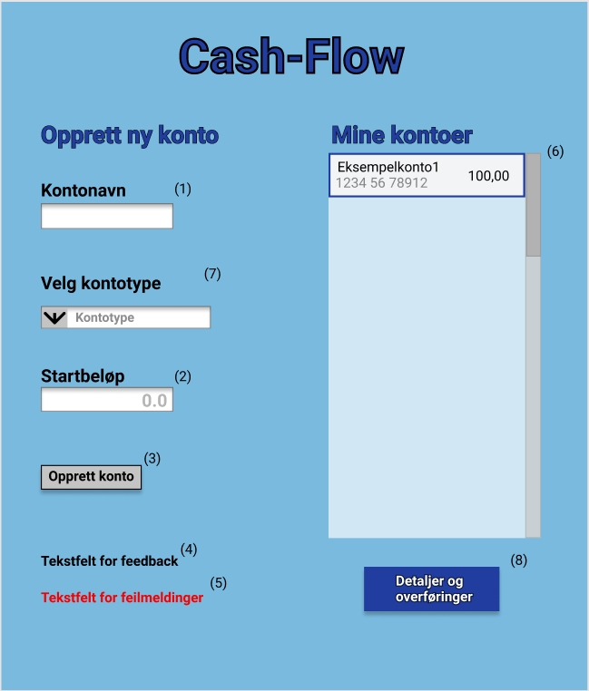

# CashFlow-app

Prosjektet går ut på en app som implementere bank-funksjonalitet. Appen skal fungere på lik linje som andre banker, der det skal være mulig å opprette, slette eller overføre mellom brukskontoer, sparekontoer og BSU-kontoer.
Det vil også være mulig å se kontohistorikken til alle kontoene.

