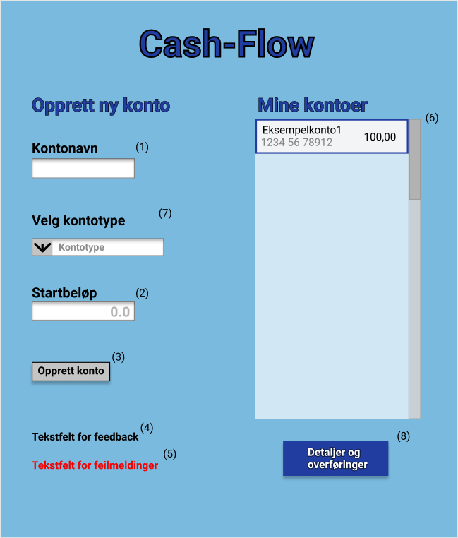
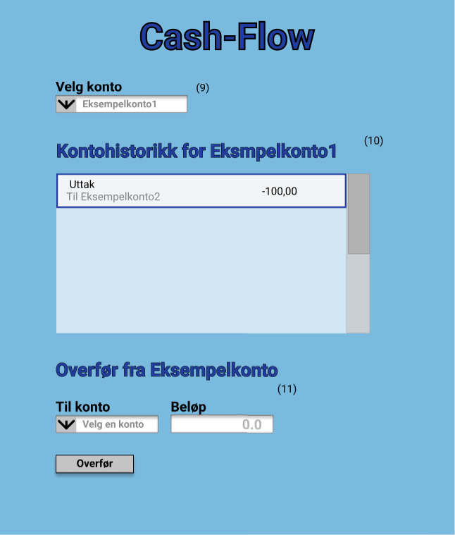

# Intro
Dette er en beskrivelse av hvordan appen skal se ut til gruppeinnlevering 2. 
Hovedfunksjonaliteten som legges til i denne releasen er:
- **Kontotype**: Brukeren skal kunne opprette forskjellige typer kontoer
- **Kontodetaljer**: Overføringshistorikken til en valgt konto
- **Overføring**: Mlighet til å overføre mellom kontoer
For å få til dette trengs det en ekstra side for detaljer og overføringer, og tilpassinger på forsiden

## Dokumentasjon som ble etterspurt i release 2
Brukerhistoriene for gruppeinnlevering ligger i [brukerhistorier](brukerhistorier.md)

Plant UML diagram for arkitekturen ligger i [arkitektur](../../cash-flow/Arkitektur.png)

Dokumentasjon av arbeidsvaner, arbeidsflyt og kodekvalitet ligger i [arbeidsvaner](../../cash-flow/arbeidsvaner.md)

Dokumentasjon av lagringsmetafor og oversikt over JSON-formatet ligger i [persistens](../../cash-flow/persistens.md)

---

# Hva som er gjort

Vi har i denne iterasjonen:
- utvidet kjernelogikken til å inkludere forskjellige typer bankkontoer, transaksjonshistorikk og lagring til disse.
- laget en ny "detalje og overføringer"-side som inneholder transaksjonshistorikken og mulighet for å overfør mellom kontoer
- laget en hjelpeklasse som skal stå for mye av verifiseringen i både kjernelogikken og kontroller. Tester har blitt satt opp for alle deler av koden utenom den nye "detalje og overføringer"-siden. 
- utbedret og utvidet koden vår samtidig som at testene skulle verifisere endringene våre. 
- modularisert prosjektet vårt
- lagt til Checkstyle, og skal fikse feilene i 3. iterasjon
- lagt til Spotbugs, og fikset feilene denne fant

---

# Designdokumentasjon
Her er en skissering av appens design og fuksjonalitet til gruppeinnlevering 2, og forklaring av de forskjellige elementene på de to sidene
## Forside

1. Inntastingsfelt for å skrive inn navn på kontoen.
2. Inntastingsfelt for å skrive inn startbeløp som skal settes inn ved opprettelse av kontoen. Det på forhånd fylt ut med “0.0”.
3. Knapp for å opprette kontoen. Kontoinformasjonen lagres og vises i oversiktsfeltet (6).
4. Tekstfelt for å gi brukeren feedback.
5. Tekstfelt for å gi brukeren feilmeldinger.
6. Oversiktsfelt som viser kontonavn, kontonummer og disponibelt beløp. Feltet har scrollefunksjon. Senere skal en bruker kunne trykke på en konto for å få mer detaljert informasjon, som for eksempel kontohistorikk. 
7. Nedtreksmeny for valg av kontotype til konto som skal opprettes
8. Knapp for å komme til siden for kontodetaljer og overføring

## Detaljer og overføringer

9. Nedtreksmeny for valg av hvilken konto sine kontodetaljer man vil se
10. Oversikt over kontohistorikken til valgt konto
11. Overføringer skjer fra kontoen som er valgt i 9. og til kontoen som velges i denne nedtreksmenyen. Beløpet skrives inn i inntastingsfeltet. Overføringen gjennomføres ved å trykke på knappen. Dette vil legge til et "uttak" i kontohistorikken til "fra-kontoen" og et "innsetting" i kontohistorikken til "til-kontoen" 
