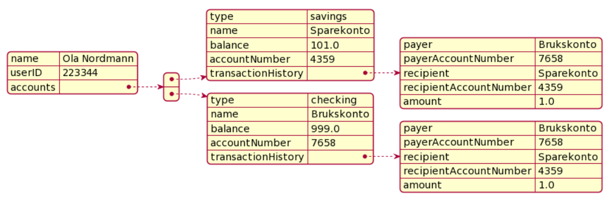

## Lagringsmetafor
Lagringen i Cash-Flow gjennomføres slik lagring av data i vanlige bank-applikasjoner gjennomføres. Det er altså **ingen eksplisitt lagringsknapp**.
- Nye kontoer lagres når de blir opprettet
- Endringer av kontodata, ved f.eks overføringer mellom kontoer, lagres når endringen gjennomføres

## Lagringsformat
Data lagres i en json-fil som konstrueres ved hjelp av serialisering med Jacksonbiblioteket. Nederst ligger et JSON-diagram. Filene har følgende format (med eksempelverdier):

```
@startjson
{
    "name": "Ola Nordmann",
    "userID": 223344,
    "accounts": [
    {
        "type": "savings",
        "name": "Sparekonto",
        "balance": 101.0,
        "accountNumber": 4359,
        "transactionHistory": 
        {
            "payer": "Brukskonto",
            "payerAccountNumber": 7658,
            "recipient": "Sparekonto",
            "recipientAccountNumber": 4359,
            "amount": 1.0
        }},{
        "type": "checking",
        "name": "Brukskonto",
        "balance": 999.0,
        "accountNumber": 7658,
        "transactionHistory": 
        {
            "payer": "Brukskonto",
            "payerAccountNumber": 7658,
            "recipient": "Sparekonto",
            "recipientAccountNumber": 4359,
            "amount": 1.0
        }
    }]
}
@endjson
```
## JSON-diagram


