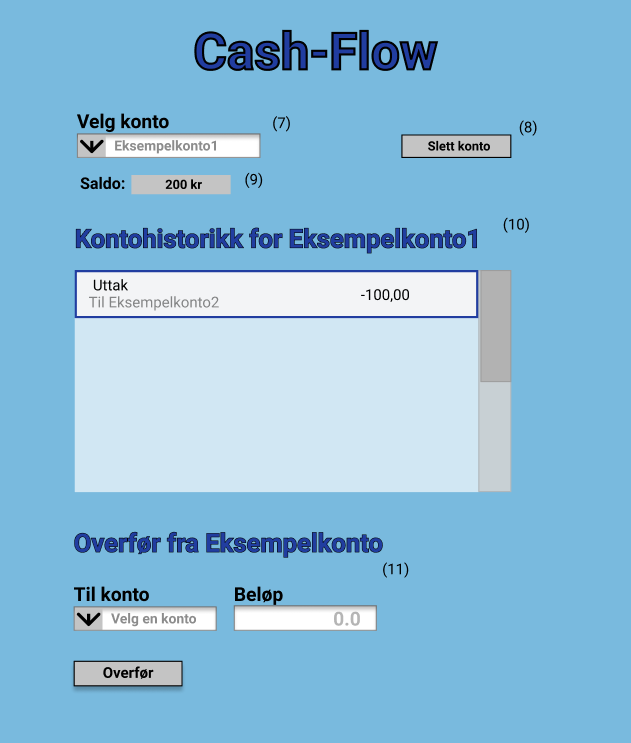

# Intro
Dette er en beskrivelse av hvordan appen skal se ut til gruppeinnlevering 2.
Hovedfunksjonaliteten som legges til i denne releasen er:

**Slette konto**: Brukeren skal kunne slette kontoer

**Saldo**: Brukeren skal kunne se saldoen til kontoen som er valgt

**RESTAPI**: Lage et RESTAPI slik at aplikasjonen kan interagere med server ved hjelp av http-forespørsler.

## Dokumentasjon som ble etterspurt i release 3
Et [pakkedigram](../../cash-flow/Pakkediagram.png) for løsningen.

Et [klassediagram](../../cash-flow/Klassediagram.png) for core-modulen.

Et [sekvensdiagram](../../cash-flow/Sekvensdiagram.png) for når man oppretter en ny konto.

Dokumentasjon av [REST-tjenesten](../../cash-flow/rest/RESTAPI.md)

# Hva som er gjort
Vi har i denne iterasjonen:
- Lagt til mulighet for å seltte kontoer og se saldo på detaljer-siden
- Bygget et RESTAPI
- Lagt til Access-objekter som lar app-kontrollerene skille mellom lokal kjøring og kjøring med RESTAPI
- Lagt til konfigurasjon av shippable produkt og mulighet til å lage en kjørbar fil med **jlink** og **jpackage**

# Designdokumentasjon
Her er en skissering av appens design og fuksjonalitet til gruppeinnlevering 2, og forklaring av de forskjellige elementene på de to sidene
## Forside 

1. Inntastingsfelt for å skrive inn navn på kontoen.
2. Inntastingsfelt for å skrive inn startbeløp som skal settes inn ved opprettelse av kontoen. Det på forhånd fylt ut med “0.0”.
3. Knapp for å opprette kontoen. Kontoinformasjonen lagres og vises i oversiktsfeltet (5).
4. Tekstfelt for å gi brukeren feedback.
5. Oversiktsfelt som viser kontonavn, kontonummer og disponibelt beløp. Feltet har scrollefunksjon. Senere skal en bruker kunne trykke på en konto for å få mer detaljert informasjon, som for eksempel kontohistorikk. 
6. Knapp for å komme til siden for kontodetaljer og overføring
7. Nedtreksmeny for valg av kontotype til konto som skal opprettes

## Detaljer og overføringer

7. Nedtreksmeny for valg av hvilken konto sine kontodetaljer man vil se
8. Knapp for å slette kontoen som er valgt i (7)
9. Felt for å vise saldoen til kontoen som er valgt i (7)
10. Oversikt over kontohistorikken til valgt konto
11. Overføringer skjer fra kontoen som er valgt i (9). og til kontoen som velges i denne nedtreksmenyen. Beløpet skrives inn i inntastingsfeltet. Overføringen gjennomføres ved å trykke på knappen. Dette vil legge til et "uttak" i kontohistorikken til "fra-kontoen" og et "innsetting" i kontohistorikken til "til-kontoen" 
